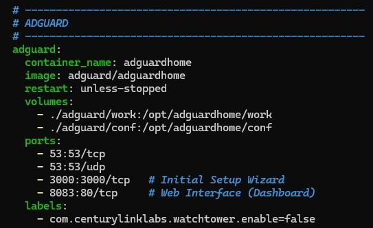

I had a panic attack recently and my mental state is getting worse. So I'm distracting myself with more work while my baby is sleeping.

I thought I'd keep a journal for my therapist of my mental state and while I was looking at apps, I was bombarded with ads, subscriptions, and just horrible app experience that I thought I'd make one my own. So I did.

### mood.montano.uk

I know how to write code in python, and I can write HTML/CSS/JS as well for front-end, but the goal is efficiency and time to deploy. So I decided to use NiceGUI, a python-based UI framework. No more using different syntax that increases cognitive load, just pure python.

If you'd guess by now, I went down the rabbit hole again. Remember when I said I was bombarded with ads? That's right, I'm tackling those head on. Not only are ads annoying, they are also used to track your internet usage which is a huge no no for me. So I looked into solutions on how to tackle this.

While a normal browser with ad-block extensions would clear ads from websites, it doesn't get rid of apps from mobile apps. So I thought I'd nip it in the bud by using a dns-based adblocker: adguard.

Short explainer: when you open an app, it contacts the internet to get the ad they're going to serve, they contact those ad-servers through known IP addresses. Adguard blocks connections to those addresses by blocking them in the DNS. Like scrubbing off the adverts from your local telephone book or newspaper.

Installing it was easy, just add the config in your docker file and you're done. But I'll probably fight this when I start adding a VPN and stuff. We'll see.
